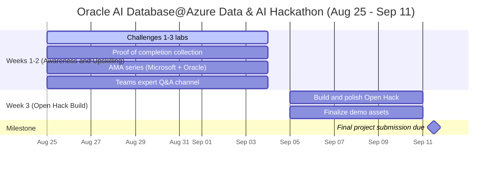

# Oracle AI Database@Azure AI Hackathon for Partners

Welcome to a **Partner-first** hackathon experience designed to showcase how **Oracle AI Database@Azure**, **Oracle MCP** and **Microsoft IQ** can power real-world, AI-driven business solutions.

This event is built for partners who want to explore, learn, and co-create with confidence. 

It combines hands-on technical learning, badge-worthy enrichment, and an **Open Hack** opportunity to build a compelling agentic solution that demonstrates business value across Oracle AI Database@Azure, Oracle MCP,Microsoft Foundry, and Microsoft IQ.

## Why this hackathon matters for partners

- Build credibility by solving a practical, modern data + AI scenario.
- Strengthen your technical story across Oracle and Microsoft ecosystems.
- Gain exposure to enterprise-grade patterns for RAG, copilots, and agentic workflows.
- Create a reusable demo narrative that can be shared with customers and stakeholders.
- Accelerate learning through guided challenges, labs, and an open-ended innovation track.
- Position your team as a trusted advisor for enterprise AI modernization.

## What partners will experience

- A structured 3-challenge journey focused on completing labs and collecting proof of completion.
- Hands-on exploration of Oracle AI Database@Azure and AI integration capabilities.
- Practical exposure to Microsoft IQ experiences and official AI blueprints by Oracle Database@Azure team.
- A final Open Hack where participants define and build a business use-case-driven solution.
- A clear path from experimentation to a compelling customer-ready story.
The hackathon is run by Oracle and Microsoft product teams, with direct access to experts across both ecosystems.

## At a glance

| Item | Details |
|---|---|
| Hackathon window | Aug 25 - Sep 11 |
| Week 1-2 focus | Awareness and upskilling |
| Week 3 focus | Open Hack build and final demo |
| Final due date | Sep 11 |
| Live support | AMA series (Microsoft + Oracle) from Aug 25 - Sep 4 |
| Ongoing support | Dedicated Teams channel for direct expert Q&A |

## Visual timeline

## Challenge 1: Understanding Oracle AI Database@Azure

**Create an **Oracle Autonomous AI Database** on **Oracle AI Database@Azure**.**
- **Goal**: Complete this [lab](https://livelabs.oracle.com/ords/r/dbpm/livelabs/view-workshop?wid=4339) and provide clear proof of completion.

## Challenge 2: Understanding Microsoft IQ 

****Work through the IQ-series and Complete **Microsoft IQ** modules for **Fabric IQ, Work IQ, and Foundry IQ **experiences.********

**Goal**: Complete **[Microsoft IQ](https://github.com/microsoft/iq-series](https://github.com/microsoft/iqdeepdive)** learning series and provide proof of completion.

## Challenge 3: Build a RAG
**Build a working RAG application using Oracle Autonomous AI Database, Oracle AI Vector Search, and Azure OpenAI.**
- **Goal**:Complete this [lab exercise](https://docs.oracle.com/en/cloud/paas/multicloud/database-at-azure/latest/azlab/overview.html) and provide proof of completion.

## Open Hack: Build an agent or agentic solution

**Goal**: Use completed lab experience to define and build a business use case with a cohesive end-to-end solution.

Business use case expectation:
- Clearly state the business problem, target users, and measurable impact.
- Show how Oracle AI Database@Azure and Microsoft IQ capabilities connect in one solution flow.
- Demonstrate a working user journey from question or trigger to business outcome.

Recommended patterns:
- Official Knowledge worker [AI blueprints](https://github.com/Azure/Oracle-AI-Database-at-Azure) published by **Oracle AI Database@Azure** team.
  
## Bonus

A strong **bonus** submission includes:
- Review of existing [AI Blueprints](https://github.com/Azure/Oracle-AI-Database-at-Azure) (Leave us a star if you like what is published and also initiate a discussion on scope for improvements)
- Oracle + Work IQ implementation.
- Propose a new cohesive connection to build between Oracle and Microsoft ecosystems that doesnt exist today for AI solutioning.

-Change the timeline mermaid diagram
- Add judges section
- Evaluation criteria
- Chance to co-present and prizes section

